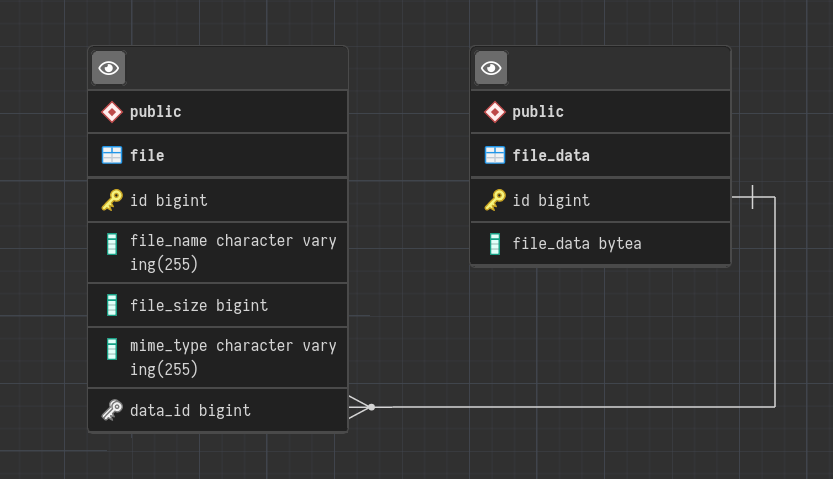

# storage-service

File storage backend application.

This service stores files in a PostgreSQL database as BLOB(oid).

## Requirements

* [Java 17+](https://projects.eclipse.org/projects/adoptium.temurin)
* [Docker](https://www.docker.com/)

## SQL ERD



The `file_size` column store the size of the file as **bytes**.

## Usage

You can deploy, build and test the app with the `Makefile`, add the option `-j $(nproc)` when convenient.

Depending on the type of `'compose'` you are using, change the `COMPOSE_CMD` variable in the `Makefile`.

### Container

Build the backend image.

``` bash
make build-container
```

Or just deploy it, docker automatically builds the image it can't find it.

``` bash
make deploy
```

### Jar

Before building the jar file, start a `postgreSQL` instance. This is the configuration for the database connection in the `application.yaml`. So keep this in mind before building the jar.

``` yaml
spring:
  ...
  datasource:
    url: jdbc:postgresql://${POSTGRES_HOSTNAME:localhost}:${POSTGRES_PORT:5432}/${POSTGRES_DB:sn_storage_service}
    username: ${POSTGRES_USER:sn_user}
    password: ${POSTGRES_PASSWORD:sn_user}
```

Build the jar.

``` bash
make build-jar
```

### Tests

Remember to start a `Docker` daemon first. Because of `Testcontainers`.

``` bash
make test
```

## Consume the API

The application has four endpoints.

* Upload a file:

  ``` bash
  curl -F attachment=@<file path> -X POST 'http://<host>:<port>/files'
  ```

* Update a file:

  ``` bash
  Not implemented yet
  ```

* Get a list of files:

  `limit` is the number of elements you want, must be greater than 1 e.g 10, 15, 20, etc.

  `offset` is the number of skipped elements in other words the page that wou want, must be a apositive number increased by ten e.g 0, 10, 20, 30, etc.

  ``` bash
  curl -X GET 'http://<host>:<port>/files?limit=<number>&offset=<number>'
  ```

* Download a file:

  ``` bash
  curl -X GET -o <your output file path> 'http://<host>:<port>/files/<file id>'
  ```

* Delete a file:

  ``` bash
  curl -X DELETE 'http://<host>:<port>/files/<file id>'
  ```
