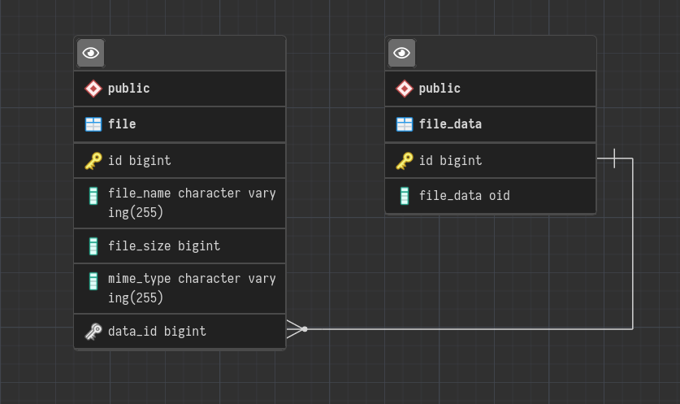

# storage-service

File storage backend application.

This service stores files in a PostgreSQL database as BLOB(oid).

## Requirements

* [Java 17+](https://projects.eclipse.org/projects/adoptium.temurin)
* [Docker](https://www.docker.com/)

## SQL Diagram

The `file_name` column store only the **file name**, absolute paths sent by clients are ignored, `file_size` column store the size of the file in **bytes**.
